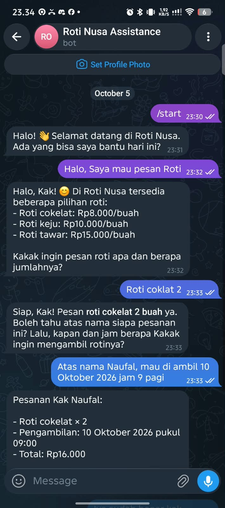
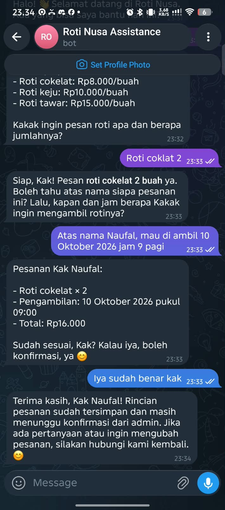
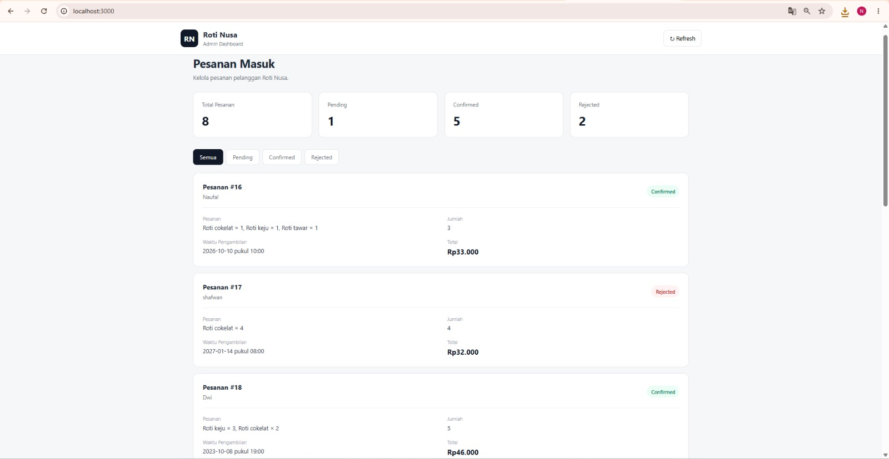
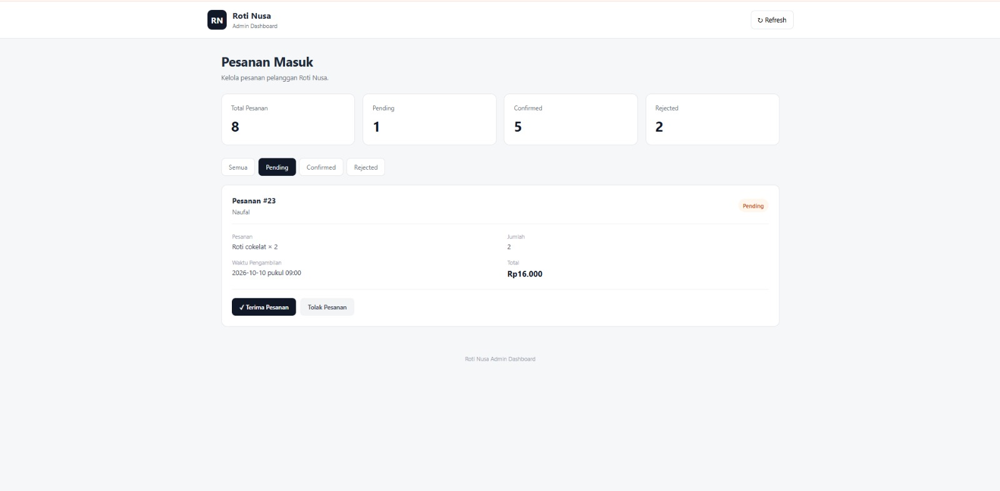
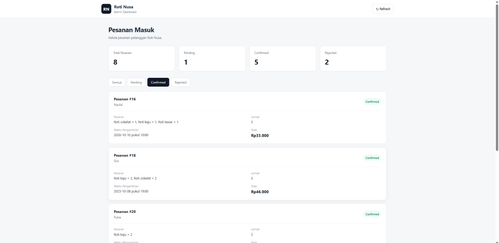
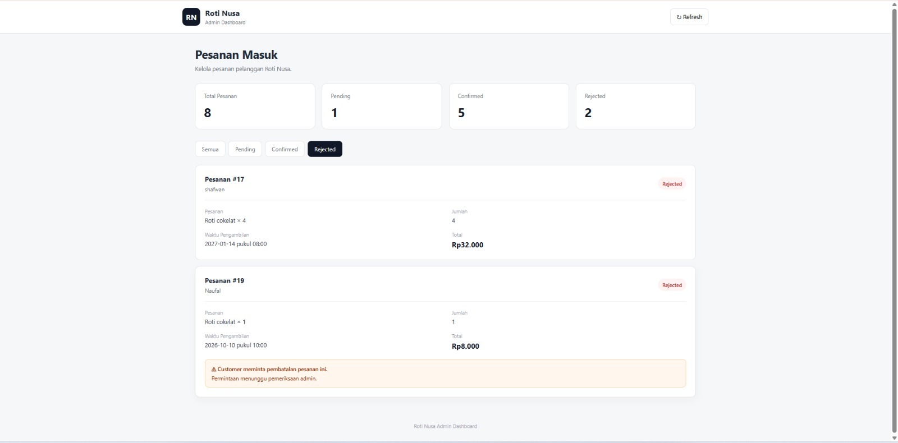
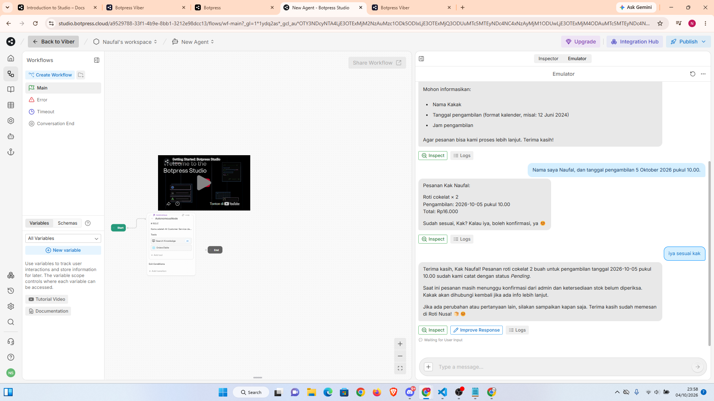

# Roti Nusa AI Order Assistant

> **AI-powered customer service and ordering assistant for Telegram**

Roti Nusa AI Order Assistant is an AI-powered chatbot designed to assist customers with product inquiries and the ordering process through Telegram.

The system is designed to understand customer conversations, collect the information required for an order, and generate a structured order summary for administrative confirmation.

---

## Project Overview

Customer service and order handling can become repetitive when customers frequently ask about products, availability, pricing, and ordering procedures.

This project explores how **AI-powered conversational automation** can be used to simplify the initial customer service and ordering workflow.

The assistant acts as the first point of interaction between the customer and the business.

### Main Objective

* Reduce repetitive customer inquiries
* Make product information easier to access
* Collect order information in a structured format
* Generate a clear order summary for the admin
* Create a more efficient customer ordering experience

---

## Key Features

### AI Customer Service

The assistant can interact with customers using natural language and respond according to the configured business information.

### Product Information

Customers can ask about available products and related information through the Telegram conversation.

### Order Information Collection

The assistant collects important information required for an order, including:

* Customer name
* Product and quantity
* Total price
* Pickup time

### Automated Order Summary

Once the required information has been provided, the assistant generates a structured order summary for administrative processing.

### Admin Confirmation Workflow

Orders are not automatically considered confirmed. The generated order summary is treated as a request waiting for administrative confirmation.

---

## Conversation Flow

```text
Customer
   │
   ▼
Telegram
   │
   ▼
AI Order Assistant
   │
   ├── Understand customer request
   │
   ├── Provide product information
   │
   ├── Collect order information
   │
   ▼
Order Summary
   │
   ▼
Admin Review
   │
   ▼
Order Confirmation
```

---

## Order Summary Structure

The assistant generates an order summary containing:

| Information        | Description                       |
| ------------------ | --------------------------------- |
| Customer Name      | Customer's name                   |
| Product & Quantity | Ordered products and quantities   |
| Total Price        | Calculated order total            |
| Pickup Time        | Requested pickup time             |
| Stock Status       | Stock verification status         |
| Order Status       | Current order confirmation status |

The assistant is configured not to invent missing information. If required information is unavailable, the customer is asked to provide it before the order summary is completed.

---

## Technology Stack

| Technology   | Purpose                                   |
| ------------ | ----------------------------------------- |
| **Botpress** | AI chatbot and conversation workflow      |
| **Telegram** | Customer-facing messaging platform        |
| **AI / LLM** | Natural language understanding            |
| **Database** | Data storage and management               |
| **GitHub**   | Version control and project documentation |

---

## My Role

I designed and developed the AI ordering workflow, including:

* Designing the customer conversation flow
* Configuring AI instructions and responses
* Designing the order information collection process
* Creating the structured order summary
* Integrating the chatbot with Telegram
* Designing the admin confirmation workflow
* Testing the conversation flow
* Documenting the project

---

## Project Architecture

```text
┌──────────────┐
│   Customer   │
└──────┬───────┘
       │
       ▼
┌──────────────┐
│   Telegram   │
└──────┬───────┘
       │
       ▼
┌──────────────┐
│   Botpress   │
│ AI Assistant │
└──────┬───────┘
       │
       ├──────────────► Product Information
       │
       ├──────────────► Order Data Collection
       │
       ▼
┌──────────────┐
│ Order Summary│
└──────┬───────┘
       │
       ▼
┌──────────────┐
│    Admin     │
│   Review     │
└──────────────┘
```

---

## Screenshots

### Telegram Conversation





### Admin Dashboard









### AI Workflow


---

## Project Outcome

This project demonstrates the implementation of a conversational AI workflow for a real-world business scenario.

Rather than functioning only as a simple chatbot, the system is designed around a specific business process:

**Customer Inquiry → Information Collection → Order Summary → Admin Confirmation**

The project provided practical experience in designing AI workflows, conversational logic, messaging platform integration, and business process automation.

---

## Future Development

Potential improvements for future versions include:

* Admin dashboard for managing orders
* Automated stock checking
* Real-time order database
* Automated notifications for administrators
* Customer order history
* Automated customer follow-up
* Payment integration
* Business analytics dashboard

---

## Project Status

**Prototype / Portfolio Project**

This project is developed as a practical implementation of AI-powered customer service and business process automation.
